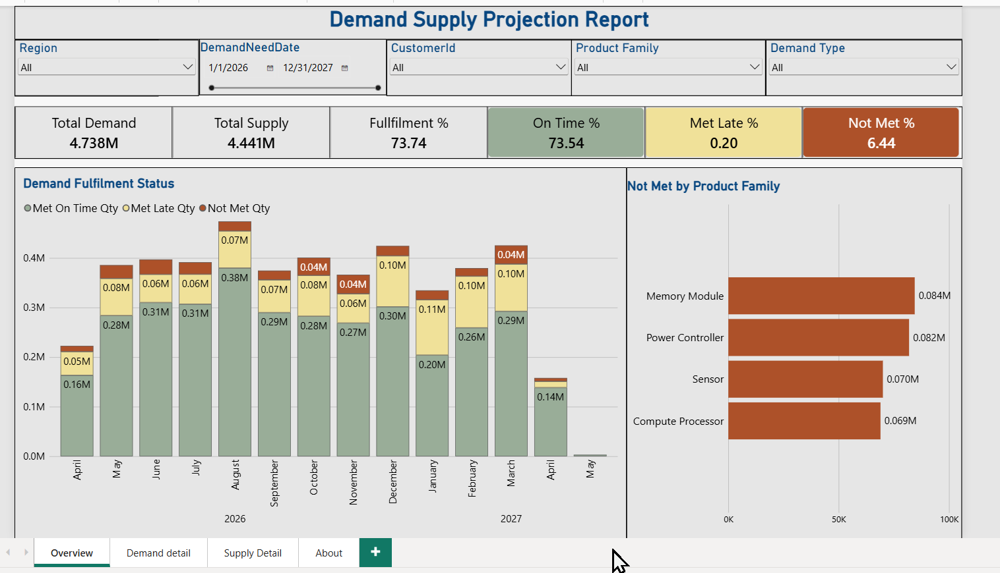
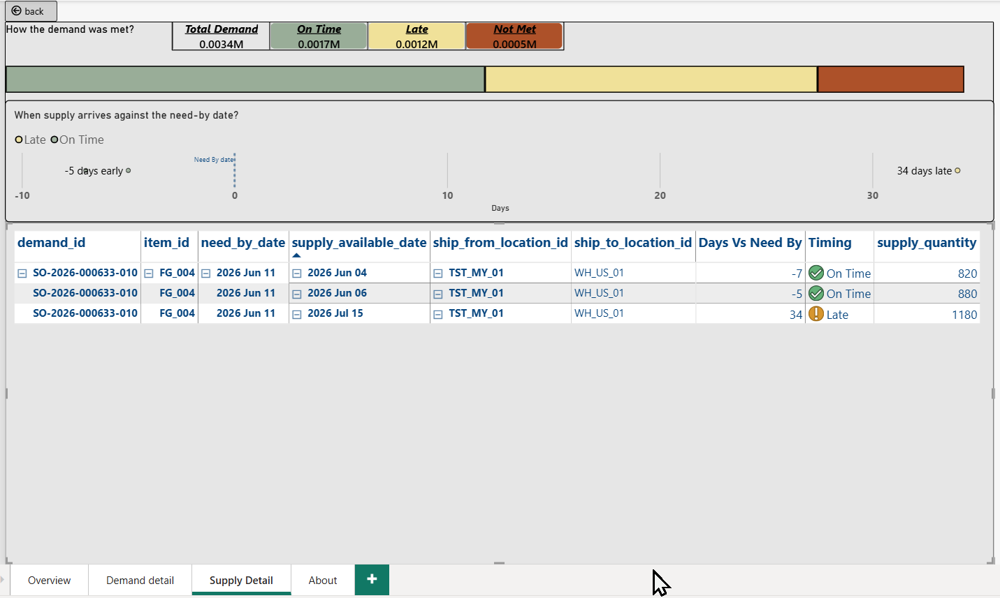

# Demand Supply Projection Report

A Power BI report that shows whether customer demand is being met by supply, when that supply is available, and where the shortfalls are, so planners can act before a gap becomes a bottleneck.

> **All data in this project is synthetic.** It was generated for this portfolio project. It does not come from any employer or customer.



## View the report

GitHub can't display a Power BI file in the browser, so there are three ways to see it:

- **Quick look:** read the [report as a PDF](https://github.com/DinakariMohan/demand-supply-projection-powerbi/blob/main/Demand_Supply_Projection_Report.pdf) (all pages, no software needed)
- **Explore it:** [download the Power BI file](https://github.com/DinakariMohan/demand-supply-projection-powerbi/blob/main/Demand_Supply_Projection_Report.pbix) and open it in [Power BI Desktop](https://powerbi.microsoft.com/desktop/) (free, Windows). Use the slicers and right-click a bar or a demand line to drill through
- **Screenshots:** see the [images](02_demand_detail.png) 

## The business question

A customer orders 10,000 units. 6,000 arrive on time, 2,500 arrive late and 1,500 never arrive. Is that order "fulfilled" or "late"? It is all three.

Most reports collapse an order into one status. This report keeps the split, so a planner can see how much of every demand line was met on time, met late, or not met, and when each piece of supply became available.

## What the report answers

- How much demand is met on time, met late, and not met, by month, region, product family and customer?
- Which product families have the largest not-met quantity?
- For one demand line, which supply lines filled it, and how many days before or after the need-by date did each arrive?

## Report pages

| Page | What it shows |
|---|---|
| **Overview** | Cards for total demand, total supply, fulfilment %, on time %, met late % and not met %. A monthly chart of met on time, met late and not met quantity. Not met quantity by product family. Slicers for region, date, product family and customer |
| **Demand detail** (drill-through) | Demand lines filtered by line status: Fully Met On Time, Fully Met Late, Met Partly Late, Partially Met, Not Met |
| **Supply detail** (drill-through) | For one demand line: how it was met (on time, late, not met), a timeline of supply arrivals against the need-by date, and a table of supply lines with days vs need-by |
| **About** | Report description and definitions of every status and term |



## Key definitions

| Term | Meaning |
|---|---|
| Need-by date | The date the customer needs the product |
| Supply available date | The date a supply line is available to ship |
| Met on time qty | Supply that counts toward the demand and is available on or before the need-by date |
| Met late qty | Supply that counts toward the demand and is available after the need-by date |
| Not met qty | Demand minus met on time minus met late |
| Fulfilment % | (Met on time + met late) / demand |

**Line status**

| Status | Meaning |
|---|---|
| Fully Met On Time | All of the demand arrived on or before the need-by date |
| Fully Met Late | All of the demand arrived, but all of it after the need-by date |
| Met, Partly Late | All of the demand arrived. Part was on time and part was late |
| Partially Met | Some of the demand never arrived. The rest can be on time, late, or both |
| Not Met | None of the demand arrived |

The full list is on the **About** page of the report.

## How demand is matched to supply

One demand line can be filled by several supply lines on different dates. The report therefore works at **quantity level**, not line level:

1. Supply lines for a demand line are sorted by available date. **Earliest supply fills the demand first**, up to the demand quantity.
2. Supply available on or before the need-by date counts as **on time**. Later supply counts as **late**.
3. Whatever is left of the demand is **not met**.

Simplified logic, per demand line:

```
met_on_time_qty = MIN(demand_qty, supply_on_time_qty)
met_late_qty    = MIN(demand_qty - met_on_time_qty, supply_total_qty - supply_on_time_qty)
not_met_qty     = demand_qty - met_on_time_qty - met_late_qty
```

A reconciliation check, `demand - on time - late - not met`, must equal zero.

## Data model

A star schema with natural keys (for example `FG_001`, `CUST_001`, `WH_EU_01`). Demand and supply are kept as two separate fact tables, because one demand line can have more than one supply date.

- Dimensions: date, item, location, customer, and others
- Facts: `fact_demand`, `fact_supply`, plus sales and ledger tables in the source workbook
- `fact_supply` links to `fact_demand` on `demand_id`

The synthetic data includes test cases built to stress the logic: demand lines that are partly on time, partly late and partly not met at the same time, and supply with no demand.

## Repository structure

```
/
├── README.md
├── Demand_Supply_Projection_Report.pbix
├── Demand_Supply_Projection_Report.pdf
│   └── demand_supply_star_schema.xlsx
│   ├── 01_overview.png
│   ├── 02_demand_detail.png
│   └── 03_supply_detail.png
```

## How to open it

1. Download the `.pbix` file (open it on GitHub, then select **Download raw file**).
2. Open it in Power BI Desktop.
3. If Power BI asks, point the data source to `data/demand_supply_star_schema_v2.xlsx`.

## Known limitations

- The data is synthetic, so the numbers show the method, not real performance.
- The report compares need-by dates with supply available dates. It does not model capacity, stock on hand or consumption.
- Supply with no demand is outside the scope of this version.
- The Demand detail page is not yet at single demand-line level, so drilling through to supply is being improved.

## What's next

Ideas I'm considering. I'd like to know which one would be most useful:

1. **Bottleneck view**: which factory, stage or route causes the late supply (yield, lead time, throughput)
2. **Excess supply view**: supply with no demand, and where it could be redeployed
3. **Cost and profit view**: COGS and manufacturing expense against sales
4. **What-if view**: change a lead time or yield and see the effect on on time %

Open an issue or leave a comment with your vote.

## About me

I'm Dinakari Mohan, a business and data analyst in global supply chain, based in Västerås, Sweden. I'm building this project to practise SQL, Power BI and DAX, and I'm still learning DAX, so feedback is welcome.

- GitHub: [github.com/DinakariMohan](https://github.com/DinakariMohan)
- LinkedIn: [www.linkedin.com/DinakariMohan](https://www.linkedin.com/DinakariMohan)
